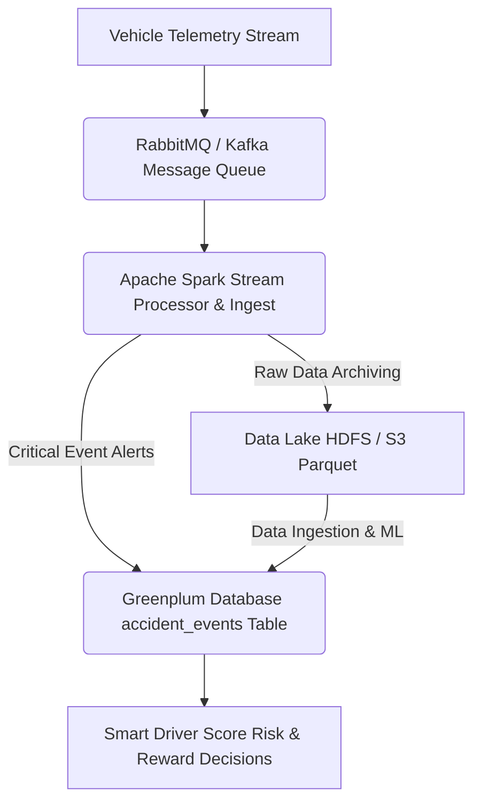

# The Demo Narrative: "From Raw Telemetry to Actionable Insight" (Greenplum ML Edition)

The ultimate goal remains consistent: to **calculate a dynamic Smart Driver Score** for each customer. This score is designed to:
- 🚫 Identify **risky drivers** for timely intervention.
- ✅ Reward **safe drivers** through tailored incentives.
This creates a direct, measurable link between **data intelligence** and **tangible business outcomes**.

---

## 🏗️ The Revised Architecture: Greenplum at the Core

This updated approach champions a "best-of-breed" architecture, strategically positioning **Greenplum Database (GPDB)** as the **central analytical powerhouse**.



### Key Architectural Components:

-   **🐇 RabbitMQ (or Kafka)**: The high-velocity message queue, serving as the **primary entry point** for real-time telemetry data streams originating from vehicles.
-   **⚡ Apache Spark**: The robust **real-time stream processor** and efficient data ingest engine, designed for high-throughput operations.
-   **💾 Data Lake (HDFS/S3)**: The cost-effective, long-term **storage solution** for archiving all raw historical telemetry data in optimized formats like Parquet.
-   **📊 Greenplum Database (GPDB)**: The high-performance, massively parallel processing (MPP) data warehouse, now also functioning as the **primary in-database machine learning and advanced analytics engine**.

---

## 🚀 The Integrated Workflow: A Step-by-Step Breakdown

Here's how this solution is architected, with Greenplum's powerful in-database ML capabilities at its centerpiece:

### Step 1: Real-Time Event Detection & Data Archiving with Spark (The Sentry)

**Scenario**: Raw telemetry data is a veritable firehose. The system must simultaneously:
1.  **React Instantly** to critical events (e.g., a vehicle crash).
2.  **Archive All Raw Data** for future comprehensive trend analysis.

**Solution**: A dedicated **Spark Streaming job** that continuously reads from RabbitMQ.

This Spark job is meticulously designed for high-speed, focused processing:

-   **📥 Consume the Stream**: The job establishes a resilient connection to RabbitMQ, processing incoming telemetry messages in **micro-batches**.
    ```json
    {
      "policy_id": "XYZ",
      "timestamp": "2024-07-24T15:30:00Z",
      "speed_mph": 75.0,
      "hard_braking_event": true,
      "sudden_deceleration_g": 4.5
    }
    ```
-   **🚨 Detect Critical Events**: The job applies **simple, business-critical logic** in real-time to identify immediate risks.
    *Logic Example*:
    ```
    IF sudden_deceleration_g > 4.0 THEN flag as 'potential_accident'
    ```
-   **✍️ Write Alerts to Greenplum (Immediate Action)**: When a critical event (like an accident) is detected, Spark immediately writes a concise record to a dedicated `accident_events` table within Greenplum using the **Greenplum-Spark Connector**.
    *Impact*: This enables the business to trigger **immediate operational workflows**, such as alerting a claims agent or dispatching emergency services.
-   **📦 Archive Raw Data to the Data Lake (Future Analysis)**: The *same* Spark job efficiently takes **all** the raw telemetry data it processes and writes it in bulk to your HDFS data lake. Data is stored in an optimized format like **Parquet**, with appropriate partitioning.
    *Benefit*: This systematically builds a rich, historical dataset **without burdening the main Greenplum database with raw data ingestion**, ensuring optimal performance for analytical queries.